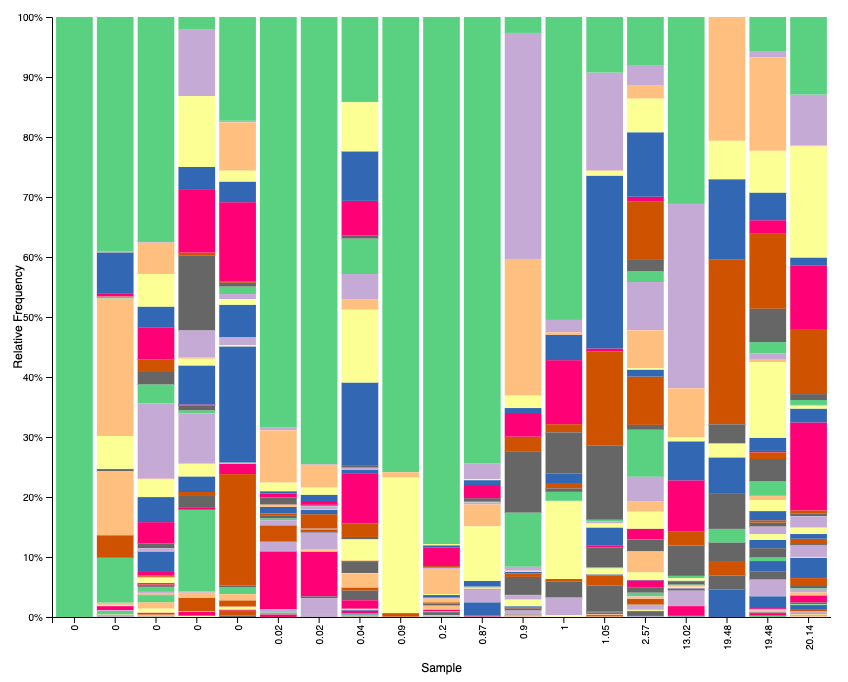

# gen711-final-project-algae-sarah-and-kelly
Final project for GEN711 using algae data

Sarah Nicholls
working on algae project

Kelly Birkenmeier
team algae woot

## Background
Diatoms are a type of photosythesizing algae. They are found in most environments that are moist, including fresh water, salt water, and soil. Diatoms have a variety of uses in filters, paints, and toothpaste among many other things. Typically, diatoms have a range of 20-200 microns in length, but they can occasionally get up to 2 millimeters. There are many different factors that effect the growth of diatoms. Some environmental factors that affect the growth of algae include metals, pH, UV stress, and nutrient availability as noted in the article by Gauthier, Senhorinho, and Scott. Of the factors mentioned above, sality and nutrient avaibility are two of the most common.

## Methods
The rbCl sequences of Tapolczai _et al._ (2019) were downloaded in fastq format into the Visual Studio Code application. Our analysis took place on the University of New Hampshire RON cluster loaded with several conda environments.
In the conda "genomics" environment, we ran fastp on the fastq files to trim off the poly-G tails added during novaseq. 

We then entered the conda "qiime-2-2021.4" environment to convert the fastqs into a qza file, then remove the primers and adaptors from the sequences. The sequences were then denoised using the R package dada2 in order to decrease the amount of sequencing errors in the files. Finally, the sequences were compared to reference taxonomy barcodes by Rimet _et al._ (2019) in order to identify the species from which the experimental reads came. This data was converted into a qzv barplot for easy viewing on the qiimeview website. Background information about the algae samples was incorporated into the barplot using a metadata file.

See our code files (located at the top of this repository) for a comprehensive breakdown of the BASH/Linux commands performed on this data in Visual Studio Code.

## Results

Figure 1. Relative percent frequencies of diatom species (Tapolczai _et al._ 2019) in locations under different levels of stress. Created with qiime in Visual Studio Code.

In locations where stressors are present (HighStr, SomeStr, Str), there is a larger percentage of identifiable species compared to locations with minimal stressors (BestRef); this corresponds to a general trend of higher species diversity with higher stress. Unidentifiable/unassigned sequences are denoted in green. Particularly, there is a higher frequency of _Cocconeis placentula_ (denoted in peach) in higher-stress areas compared to in BestRef. Due to the large percentages of unassigned data in the BestRef regions, it is likely that more or higher-quality data is required to accurately compare relative frequencies of most other species between HighStr and BestRef.

Figure 2. Relative percent frequencies of diatom species (Tapolczai _et al._ 2019) in locations with differing levels of urban character. Created with qiime in Visual Studio Code.

In more urban locations, there is a larger percentage of identifiable species compard to less urban locations; this corresponds to a general trend of higher species diversity in more urban locations. Particularly, there is a higher relative frequency of species in the _Achnanthidiaceae_ family (denoted in magenta and lavender) in more urban locations. In locations with medium urban character, there is a higher frequency of species in the _Melosira_ and _Gomphonema_ genii (denoted in maroon and blue respectively) than in both lowly and highly urban areas. Due to the large percentages of unassigned data in the less urban regions, it is likely that more or higher-quality data is required to accurately compare relative frequencies of most other species between areas with low and high urban character.

Figure 3. Relative percent frequencies of diatom species (Tapolczai _et al._ 2019) in locations with differing levels of agricultural character. Created with qiime in Visual Studio Code.

In locations with higher agricultural character, there is a larger percentage of identifiable species compard to less agricultural locations; this corresponds to a general trend of higher species diversity in more agricultural locations. Particularly, there is a higher relative frequency of species in the _Achnanthidium_ and _Melosira_ genii (denoted in lavender and maroon respectively) in more agricultural locations. By contrast, there is a general trend of a higher frequency of species in the _Anchnanthidiaceae_ family (denoted in magenta) in locations with less agricultural charcter. Due to the large percentages of unassigned data in the less urban regions, it is likely that more or higher-quality data is required to accurately compare relative frequencies of most other species between areas with low and high agricultural character.

## References

Rimet F., Gusev E., Kahlert M., Kelly M., Kulikovskiy M., Maltsev Y., Mann D., Pfannkuchen M., Trobajo R., Vasselon V., Zimmermann J., Bouchez A. Diat.barcode, an open-access curated barcode library for diatoms. Scientific Reports. 2019. https://www.nature.com/articles/s41598-019-51500-6.

Tapolczai K., Keck F., Bouchez A., Rimet F., Kahlert M., Vasselon V. Diatom DNA Metabarcoding for Biomonitoring: Strategies to Avoid Major Taxonomical and Bioinformatical Biases Limiting Molecular Indices Capacities. Ecology and Evolution. 2019;7. https://doi.org/10.3389/fevo.2019.00409.
e
Gauthier MR, Senhorinho GNA, Scott JA. 2020. Microalgae under environmental stress as a source of antioxidants. Algal Research. 52:102104. doi:https://doi.org/10.1016/j.algal.2020.102104.
‌Diatoms. 2019. Uclacuk. https://www.ucl.ac.uk/GeolSci/micropal/diatom.html.
‌
