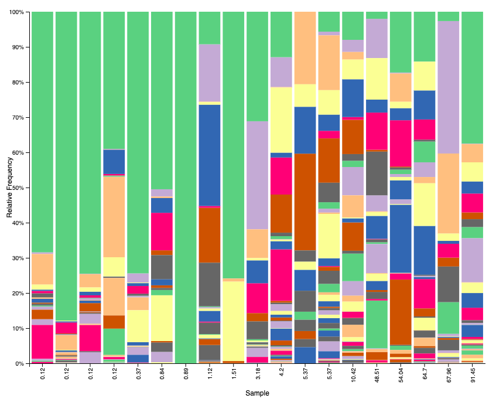

# gen711-final-project-algae-sarah-and-kelly
Final project for GEN711 using algae data

Sarah Nicholls
working on algae project

Kelly Birkenmeier
team algae woot

## Background

## Methods
**XYZ SEQUENCES** were downloaded in fastq format into the Visual Studio Code application. Our analysis took place on the University of New Hampshire RON cluster loaded with several conda environments.

In the conda "genomics" environment, we ran fastp on the fastq files to trim off the poly-G tails added during novaseq. 

We then entered the conda "qiime-2-2021.4" environment to convert the fastqs into a qza file, then remove the primers and adaptors from the sequences. The sequences were then denoised using the R package dada2 in order to decrease the amount of sequencing errors in the files. Finally, the sequences were compared to reference taxonomy barcodes by Keck (2022) in order to identify the species from which the experimental reads came. This data was converted into a qzv barplot for easy viewing on the qiimeview website. Background information about the algae samples was incorporated into the barplot using a metadata file.

See our code files (located at the top of this repository) for a comprehensive breakdown of the BASH/Linux commands performed on this data in Visual Studio Code.

## Results

UrbanCat, DistCat, Elevation, CatAreaSqKm, PctAg, InorgNWetDep.
Latitude doesn't really have any big patterns, but it's fun to look at.
