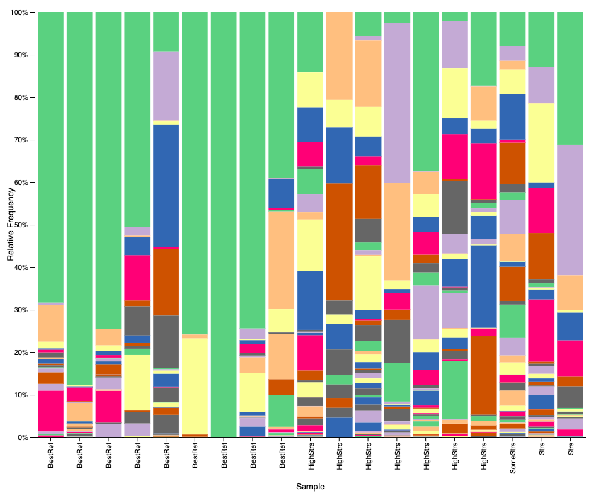

# gen711-final-project-algae-sarah-and-kelly
Final project for GEN711 using algae data

Sarah Nicholls
working on algae project

Kelly Birkenmeier
team algae woot

## Background

## Methods
The rbCl sequences of Tapolczai _et al._ (2019) were downloaded in fastq format into the Visual Studio Code application. Our analysis took place on the University of New Hampshire RON cluster loaded with several conda environments.

In the conda "genomics" environment, we ran fastp on the fastq files to trim off the poly-G tails added during novaseq. 

We then entered the conda "qiime-2-2021.4" environment to convert the fastqs into a qza file, then remove the primers and adaptors from the sequences. The sequences were then denoised using the R package dada2 in order to decrease the amount of sequencing errors in the files. Finally, the sequences were compared to reference taxonomy barcodes by Keck (2022) in order to identify the species from which the experimental reads came. This data was converted into a qzv barplot for easy viewing on the qiimeview website. Background information about the algae samples was incorporated into the barplot using a metadata file.

See our code files (located at the top of this repository) for a comprehensive breakdown of the BASH/Linux commands performed on this data in Visual Studio Code.

## Results

Figure 1. Relative percent frequencies of diatom species (Tapolczai _et al._ 2019) in locations under different levels of stress. Created with qiime in Visual Studio Code.

In locations where stressors are present (HighStr, SomeStr, Str), there is a larger percentage of identifiable species compared to locations with minimal stressors (BestRef); this corresponds to a general trend of higher species diversity with higher stress. Unidentifiable/unassigned sequences are denoted in green. Particularly, there is a larger percentage of _Cocconeis placentula_ (denoted in peach) in higher-stress areas compared to in BestRef. Due to the large percentages of unassigned data in the BestRef regions, it is likely that more or higher-quality data is required to accurately compare percent abundances of most other species betwen HighStr and BestRef.

Figure 2. Relative percent frequencies of diatom species (Tapolczai _et al._ 2019) in locations with differing levels of urban character. Created with qiime in Visual Studio Code.

Medium %urban = more prominent maroon + blue
High %urban = more prominent pink
Medium/high = more prominent lavender; more identifiable species
Peach seems to be across the board

Figure 3. Relative percent frequencies of diatom species (Tapolczai _et al._ 2019) in locations with differing levels of agricultural character. Created with qiime in Visual Studio Code.

Higher %ag = more prominent lavender + maroon
Higher %ag = more identifiable species
Lower %ag generally = more prominent pink, but not always
